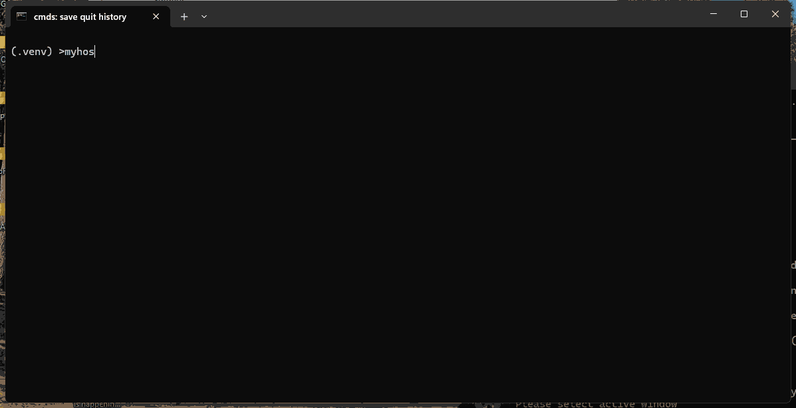

This is a tutorial files for using pluggy with argparse to create a plugin based app.

For the backgroud of this project [see this post](https://sukhbinder.wordpress.com/2024/11/08/building-plugins-based-software-with-pluggy-and-argparse/)

